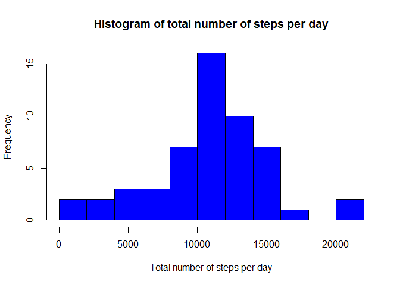
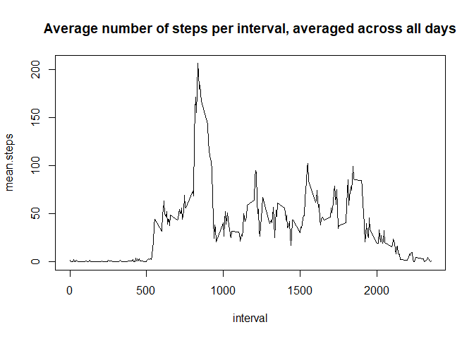
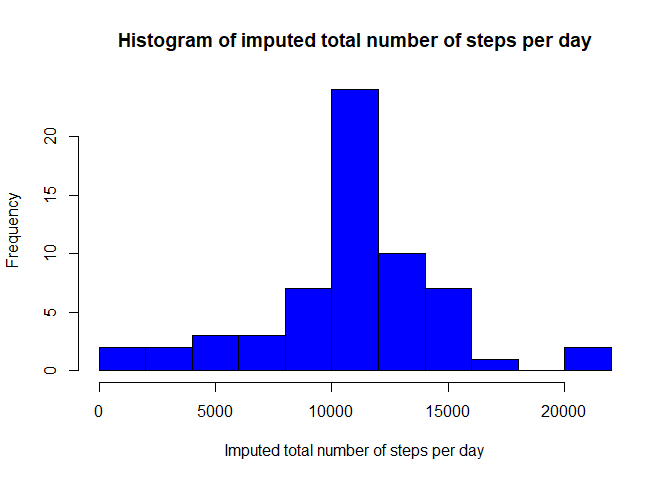
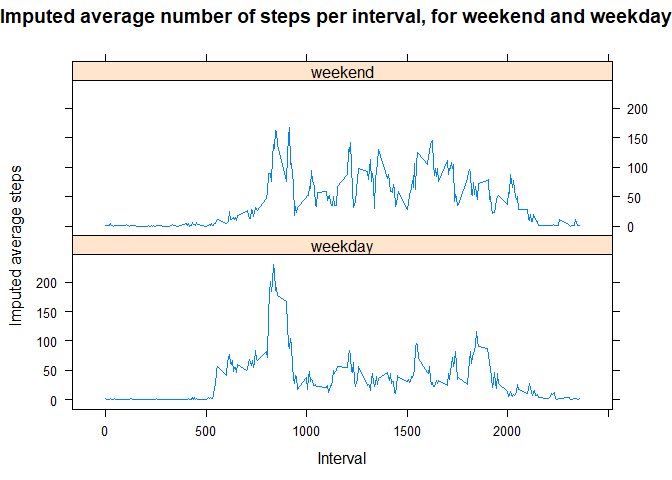

The first step of the assignment is to load and process the data. In my code I have assumed that the activity.zip file has been placed in the working directory. I also converted the column "date" to type Date.

```r
unzip("activity.zip")
activity<-read.csv("activity.csv")
summary(activity)
```

```
##      steps            date              interval     
##  Min.   :  0.00   Length:17568       Min.   :   0.0  
##  1st Qu.:  0.00   Class :character   1st Qu.: 588.8  
##  Median :  0.00   Mode  :character   Median :1177.5  
##  Mean   : 37.38                      Mean   :1177.5  
##  3rd Qu.: 12.00                      3rd Qu.:1766.2  
##  Max.   :806.00                      Max.   :2355.0  
##  NA's   :2304
```

```r
activity$date<-as.Date(activity$date)
```


### Mean total number of steps per day
This is a histogram of the total number of steps taken each day.

```r
totalsteps<-aggregate(list(total.steps=activity$steps),list(date=activity$date),FUN=sum,na.rm=FALSE)
hist(totalsteps$total.steps,main="Histogram of total number of steps per day",xlab="Total number of steps per day",col="blue",breaks=10)
```

<!-- -->

The mean and median total number of steps taken each day are, respectively:

```r
mean(totalsteps$total.steps,na.rm=TRUE)
```

```
## [1] 10766.19
```

```r
median(totalsteps$total.steps,na.rm=TRUE)
```

```
## [1] 10765
```


### Average daily activity pattern
This is a time series plot of the averate number of steps taken.

```r
averagesteps<-aggregate(list(mean.steps=activity$steps),list(interval=activity$interval),FUN=mean, na.rm=TRUE)
plot(mean.steps~interval,type="l",averagesteps,main="Average number of steps per interval, averaged across all days")
```

<!-- -->

The 5-minute interval that, on average, contains the maximum number of steps, is: 

```r
max.average.steps<-which.max(averagesteps$mean.steps)
averagesteps[max.average.steps,]
```

```
##     interval mean.steps
## 104      835   206.1698
```


### Inputing missing values
In this step, the _NA_ values are replaced by the average number of steps for that interval. 

```r
library(dplyr)
```

```
## 
## Attaching package: 'dplyr'
```

```
## The following objects are masked from 'package:stats':
## 
##     filter, lag
```

```
## The following objects are masked from 'package:base':
## 
##     intersect, setdiff, setequal, union
```

```r
activity.imputed<-full_join(activity,averagesteps)
```

```
## Joining, by = "interval"
```

```r
activity.imputed$steps.imputed<-ifelse(is.na(activity.imputed$steps),activity.imputed$mean.steps,activity.imputed$steps)
```

This is a histogram of the total number of steps taken each day, after the missing values have been imputed. The data have first been aggregated.

```r
totalsteps.imputed<-aggregate(list(imputed.total.steps=activity.imputed$steps.imputed),list(date=activity.imputed$date),FUN=sum)
hist(totalsteps.imputed$imputed.total.steps,main="Histogram of imputed total number of steps per day",xlab="Imputed total number of steps per day",col="blue",breaks=10)
```

<!-- -->

The mean and mean number total number of steps taken each day are, respectively:

```r
mean(totalsteps.imputed$imputed.total.steps)
```

```
## [1] 10766.19
```

```r
median(totalsteps.imputed$imputed.total.steps)
```

```
## [1] 10766.19
```
When comparing to the mean and median total number of steps as calculated before imputing the data, we observe that the mean total number of steps per day has stayed the same. The median total number of steps per day has changed after imputing the data, and is now equal to the mean total number of steps per day.


### Are there differences in activity patterns between weekdays and weekends?
The imputed data has been categorized as weekday-data or weekend-data. The resulting dataset has been grouped by type of day, so weekend or weekday, and interval, and has been summarized by calculating the mean for each group. The resulting groups have been plotted in a panel plot.

```r
library(chron)
```

```
## NOTE: The default cutoff when expanding a 2-digit year
## to a 4-digit year will change from 30 to 69 by Aug 2020
## (as for Date and POSIXct in base R.)
```

```r
library(lattice)
activity.imputed$weekday<-ifelse(is.weekend(activity.imputed$date),"weekend","weekday")
activity.imputed.grouped=activity.imputed %>% group_by(weekday,interval) %>% summarise_at(vars("steps.imputed"),mean)
xyplot(activity.imputed.grouped$steps.imputed~activity.imputed.grouped$interval|activity.imputed.grouped$weekday,layout=c(1,2),main="Imputed average number of steps per interval, for weekend and weekday",xlab="Interval",ylab="Imputed average steps",type="l")
```

<!-- -->
